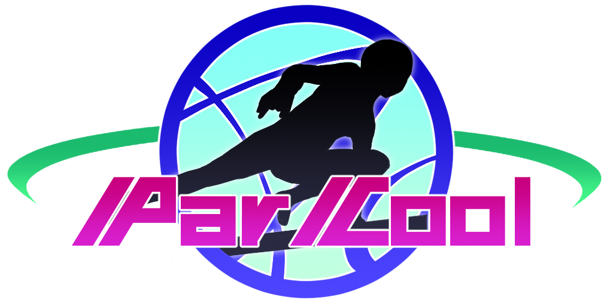

# ParCool Guide

---

### *Welcome to ParCool Project!*

This mod is a *Minecraft Forge / NeoForge* mod for more **Cool** actions like **Parkour**.  
Some actions are actually techniques of parkour.

Also you can read in-game guidebook "*ParCool Guide*" by installing *Patchouli* mod.

Now you become a parkour-player. Let's run around the Minecraft World!

If you are a beginner of this mod, I recommend to read [overview](overview.md)!

- [Index](#index)
- [Discord](#discord)

---

## Index

- [Overview for beginners](overview.md)

---

- Added System / Item / Facility
    - [Stamina](features/stamina.md)
    - [Zipline](features/zipline.md)
    - [Energy Drink](features/energy_drink.md)
- Actions
    - [Fast Run](actions/fast_run.md)
        - [Vault](actions/vault.md)
        - [Fast Swim](actions/fast_run.md#fast-swim)
        - [Horizontal Wall Run](actions/h_wall_run.md)
    - [Breakfall](actions/breakfall.md)
        - [Safety Tap](actions/breakfall.md#safety-tap)
        - [Roll](actions/breakfall.md#roll)
    - [Cling To Cliff](actions/cling_to_cliff.md)
        - [Cat Leap](actions/catleap.md)
        - [Wall Run](actions/v_wall_run.md)
    - [Hang Down](actions/hang_down.md)
    - [Climb Poles](actions/climb_poles.md)
    - [Crawl](actions/crawl.md)
        - [Slide](actions/crawl.md#slide)
    - [Charge Jump](actions/charge_jump.md)
    - [Dive](actions/dive.md)
        - [Sky Dive](actions/dive.md#sky-dive)
    - [Hide In Block](actions/hide_in_block.md)
    - [Flipping](actions/flipping.md)
    - [Dodge](actions/dodge.md)
    - [Quick Turn](actions/quick_turn.md)
    - [Wall Jump](actions/wall_jump.md)
    - [Wall Slide](actions/wall_slide.md)

---

- For server-hosts, mod-packers and developers
    - [Action Limitations](for_developer/limitations.md)
    - [Mod API](for_developer/mod_api.md)

---

## Discord

- [Invite link](https://discord.com/invite/T3kSXWRAFj)

ParCool has a community server on Discord! You can ask questions, suggest new features, talk with community members and
get announcement update.
Developer is there too. Feel free to join.
