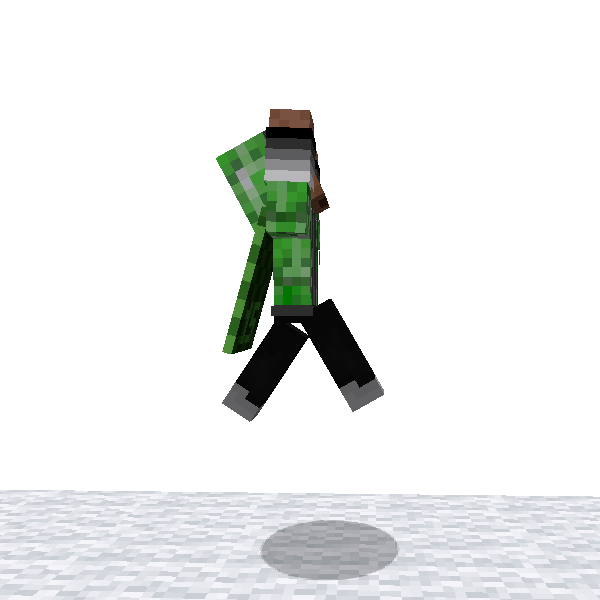
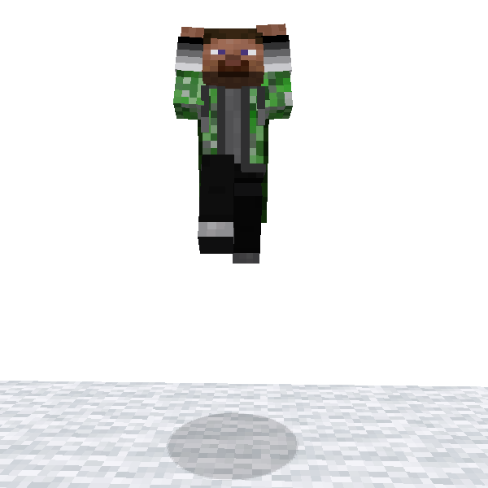

# Charge Jump

**Charge Jump** is one of ParCool skills. Jump higher by charging power.

Power starts to be charged by stopping and sneaking. The more power you store up, the higher you can jump.
You can check how much energy is stored by stamina HUD.

The peak is 2 times higher of normal jump when full charged. Even it is possible to jump onto 4 block height obstacles
by using [Cling To Cliff](cling_to_cliff.md) skill in combination.

However, please note that the charging is canceled if you move.

### 🖱️- How to use -

- Sneak to store up power
    - Press jump key whenever you want to