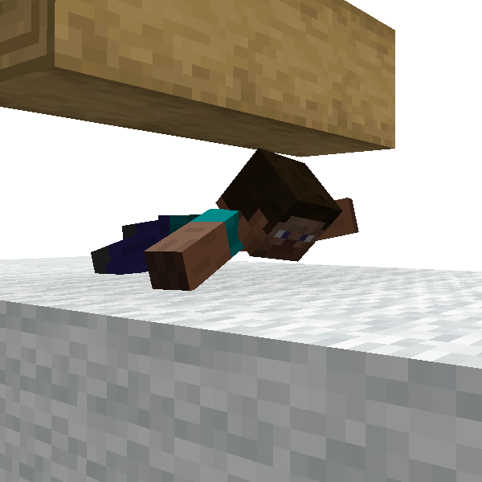
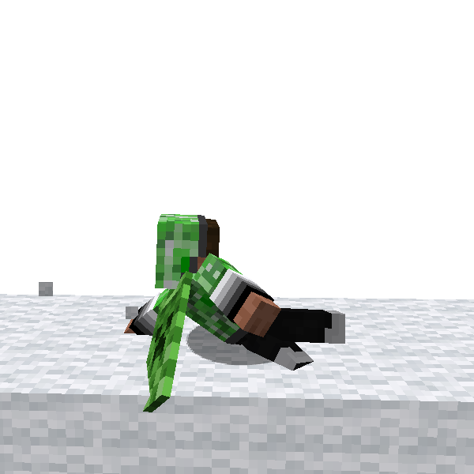

# Crawl

You can crawl everywhere and go through narrow course.
Of course, ParCool has dedicated animation for crawl!

This movement doesn't contribute to faster free running, but should improve your survival experience!

There are derived skill called [Slide](#slide). Please see below section.

### 🖱️- How to use -

- Press *Crawl* key
    - *Crawl* key is normally mapped to C key

---

## Slide

**Slide** is an action derived from [Crawl](crawl.md). You can go through narrow space quickly.

Crawl make you slow down, but Slide keep your velocity although its continuable duration is limited.

### 🖱️- How to use -

- do Crawl while doing [Fast Run](fast_run.md)
