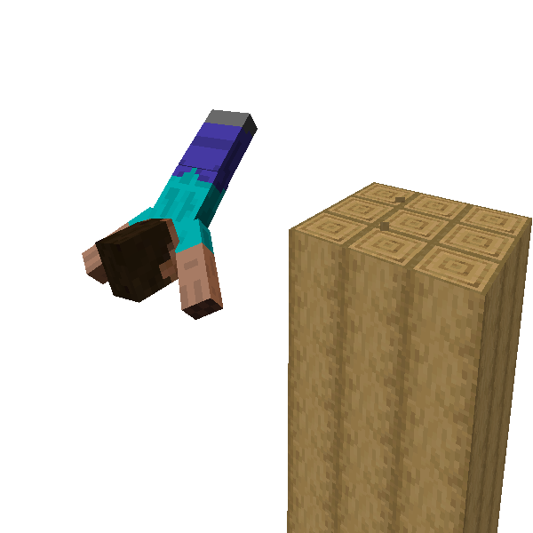
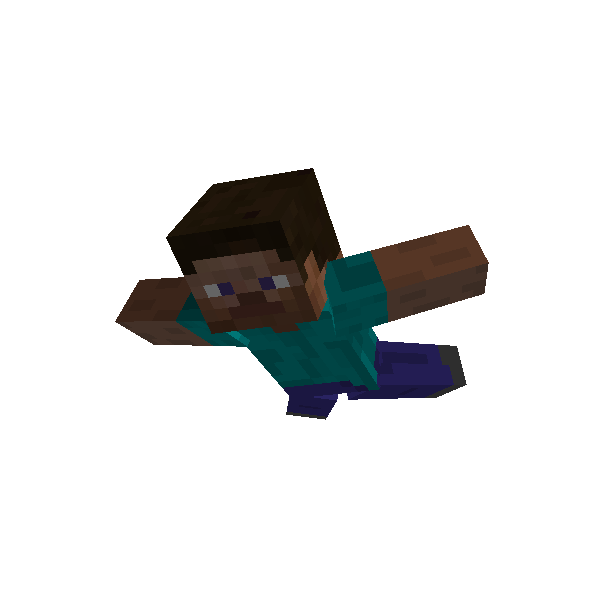

# Dive

ParCool has special jumping animation: **Diving**. Let's see it by third-person view.

It's triggered by jump into large space from high place, or jump into water.

This can be also started in air, although enough falling time.

### 🖱️- How to use -

#### Standard

- Jump into enough space or water while doing [Fast Run](fast_run.md)

#### In case of starting in air

- Continue to press *jump* key after a few seconds falling

--- 

## Sky Dive

By pressing jump key again while doing [Dive](#dive), you can do a variant of Dive : **Sky Dive**.

During this state, falling speed slightly slow down and player's horizontal movement speed gets slightly faster.

Whenever you can stop sky-dive by pressing jump key again.

### 🖱️- How to use -

- Press *jump* key while doing [Dive](#dive)
