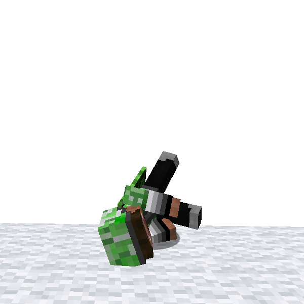

# Dodge

**Dodge** is an action for avoiding bullets or arrows. You can move quickly short distance.  
However be careful with its cool time!

Player gain invulnerable frames while doing Dodge. Except some damage type, players don't take damage completely.
The invulnerable duration is quite short so it may be difficult to utilize it well, but it possibly saves your life when
surrounded by enemies?

### How to use

#### Type 1

- Press movement key and *Dodge* key
    - *Dodge* key is normally mapped to R key

#### Type 2 (necessary to enable in config)

- Press movement keys twice quickly (unusable with forward key)