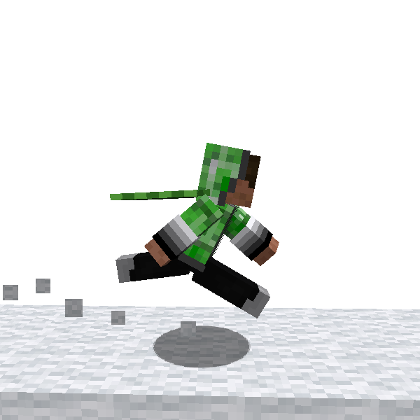

# Fast Run

Now you are a parkour player! so you can run faster than before.
This is the most basic skill : **Fast Run**

This is also a basis of some other actions, such
as [Vault](vault.md), [Horizontal Wall Run](h_wall_run.md), [Dive](dive.md), and more...

There are some type of input control, please select what you like in configuration file.

### 🖱️- How to use -

#### PressKey (Default)

- Continue to press _Fast-Run_ key during sprinting
  - _Fast-Run_ key is normally mapped to Ctrl key

#### Toggle

- Switch between normal sprint and Fast Run

#### Auto

- Automatically enabled whenever you sprint

---

## Fast Swim

Also you can swim faster than before : **Fast Swim**. It contains original animation.

Its operation is same as one of Fast Run.

### How to use

### 🖱️- How to use -

#### PressKey (Default)

- Continue to press _Fast-Run_ key during sprinting
  - _Fast-Run_ key is normally mapped to Ctrl key

#### Toggle

- Switch between normal sprint and Fast Run

#### Auto

- Automatically enabled whenever you sprint
