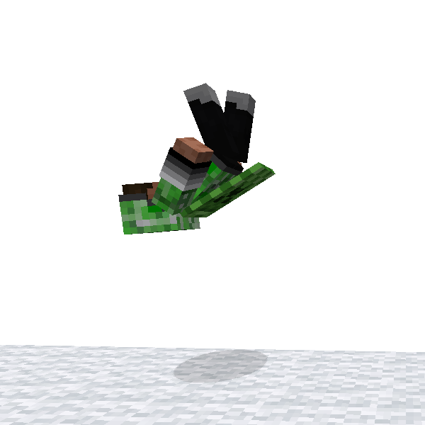
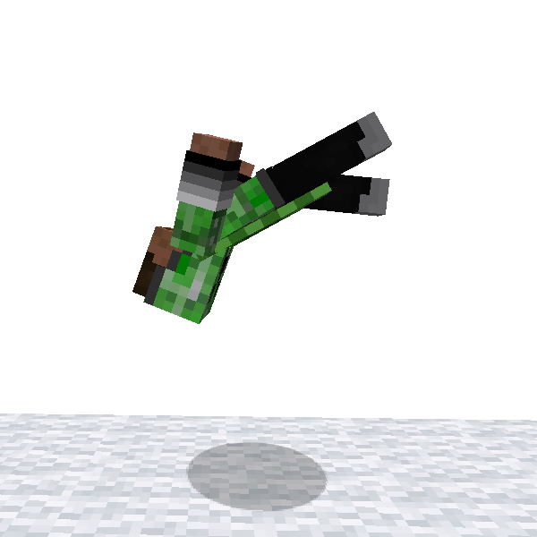

# Flipping

ParCool adds a special animation of jump: **Flipping**. There are 2 type of flip : front-flip and back-flip.

It should look cool if you perform it while doing parkour! Please be careful of your stamina depletion.

There are some type of input control, please select what you like in configuration file.

### 🖱️- How to use -

You can select which control you use by modifying config

#### TapMovementAndJump (Default)

- Press following keys simultaneously
    - jump key
    - forward or backward movement key

#### PressRightAndLeft

- Press following keys simultaneously
    - left movement key
    - right movement key

#### PressFlippingKey;

- Press *Flipping* key
    - *Flipping* key is normally mapped to nothing