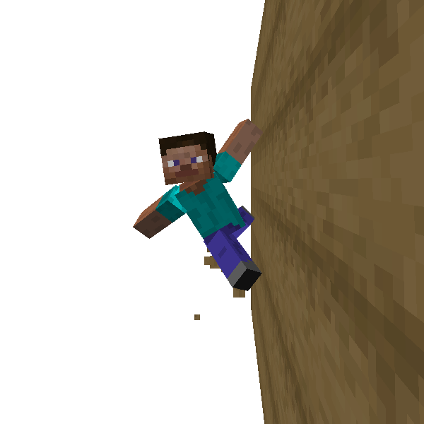

# Horizontal Wall Run

You can run horizontally sticking to wall.

This should help you to jump to a distance platform.

Although Sometimes misunderstood, the technique of *Wall Run* is vertical one, not horizontal.

You can trigger [Wall Jump](wall_jump.md) while doing this movement, so it is also possible to use this skill
continuously without landing by jumping to other wall.

There are some type of input control, please select what you like in configuration file.

Please note that you fail wall running if the wall is made of slippery material like ice block.

### 🖱️- How to use -

#### PressKey (Default)

- Do [Fast Run](fast_run.md) in air along the wall, and continue to press *Wall-Run* key
    - *Wall-Run* key is normally mapped to R key

#### Auto

- Do [Fast Run](fast_run.md) in air along the wall
