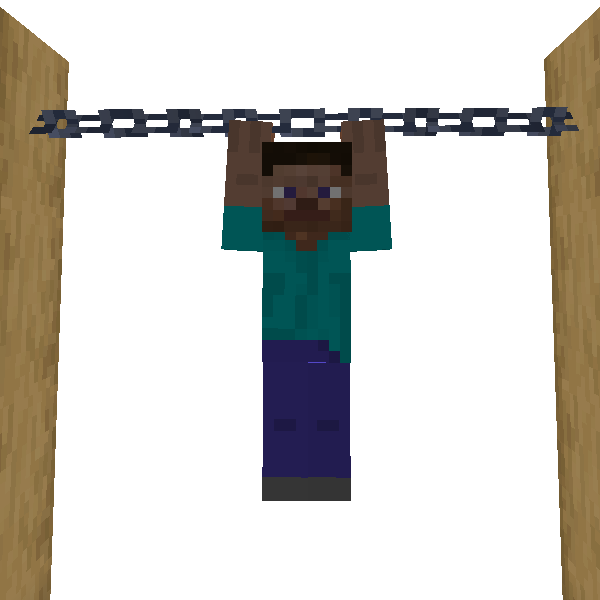

# Hang Down

You can hang on some blocks like chains or end rods.  
It is possible to move slowly and jump forward by pressing jump key.

### 🖱️- How to use -

- Press Hang Down Key below horizontal thin blocks.