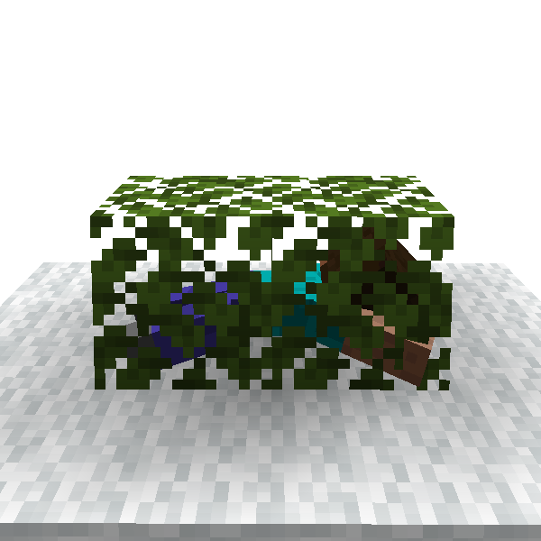

# Hide in Block

You are parkour player, but also Minecraft player. You may sometimes encounter zombies.
In that case, you can run, and hide in blocks too.

Hiding players get harder to find by enemies. Name is also hidden from other players.

You can neither break blocks nor use item while hiding, and are gotten out when you take damage or blocks are broken. Be
careful.

### Hide-able blocks

- Leaves block
- Hay block

### 🖱️- How to use -

- Press *Hide-In-Block* key while sneaking near blocks you want to hide in
    - *Hide-In-Block* key is normally mapped to C key

---

## For developers

Whether the block is hide-able is decided by its block tag.
The blocks in which hide has `hide_able` tag, so you can add new blocks for hiding with data-packs.