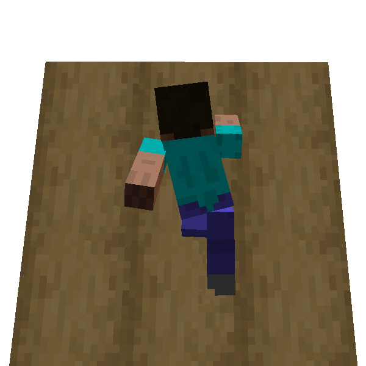

# Wall Run

**Wall Run** is a technique to jump vertically using a wall, to get over it.

Don't mistake this for [Horizontal Wall Run](./h_wall_run.md).

The jump height depends on the height of the wall. The maximum is almost 3 block height. It's the highest jump among
ParCool movements, although it needs space to take running up.

Wall Run has synergy with some other actions such as [Cling To Cliff](cling_to_cliff.md), and [Wall Jump](wall_jump.md).
Especially as for the combination with [Cling To Cliff](cling_to_cliff.md) enable to **get onto 5 block height wall** by
cling to the wall at the peak!

Please note that you fail wall running if the wall is made of slippery material like ice block.

### How to use

1. Look above horizontal line take running up with [Fast Run](fast_run.md)
2. Jump onto wall with not releasing jump key.

It may be little difficult but try it!
