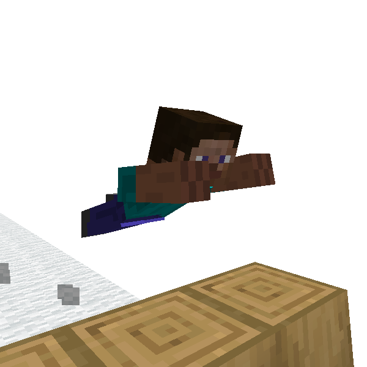

# Vault

**Vault** is skills used to get over obstacles like fences.  
It's known one of actual parkour skill.
There are numerous variations. In this game, you can use *Speed Vault* and *Kong Vault*.

## In-air Vault

You can vault in air. By utilize in-air vault it is possible to get over 2 blocks height obstacle quickly.
The point to trigger vault in air is to jump a little before the obstacle and collide with it at the jump peak.

### 🖱️- How to use -

- Collide with blocks while doing [Fast Run](fast_run.md)