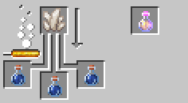
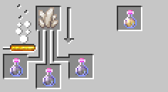
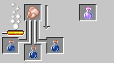
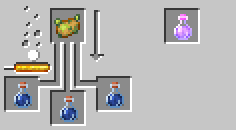

# Energy Drink

---

You frequently run out of your stamina? Let's ~~modify config~~ make **Energy Drink**. You can do ParCool moves without
consuming stamina!

Energy Drinks can be made with brewing stand.

It gives you effect : `inexhaustible`. While you have this effect, you can ignore consumption of stamina.

There are poor-quality version. It can be brewed by inexpensive materials but it has only shorter duration and unwanted
side effects.

---

## Recipes

### Energy Drink

#### [Awkward Potion] + [Nether Quartz]

#### [Poor Quality Energy Drink] + [Nether Quartz]

### Poor Quality Energy Drink

#### [Awkward Potion] + [Chicken]

#### [Awkward Potion] + [Poisonous Potato]

