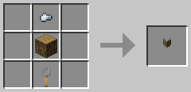
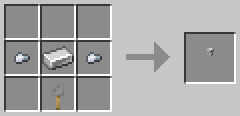
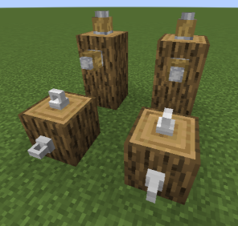
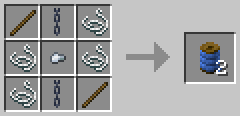
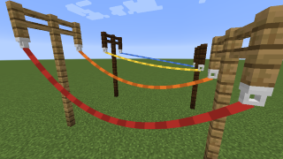
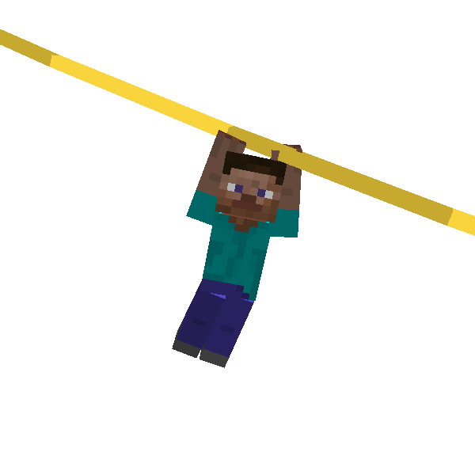

# Zipline

In this section I introduce a facility added by ParCool : **Zipline**.

This connects distant 2 points and enable players to move from one side to other end.

- [Crafting](#crafting-items)
    - [Zipline Hook](#zipline-hook)
    - [Zipline Rope](#zipline-rope)
- [Place Zipline](#placing-zipline)
- [How to use Zipline](#how-to-use)

--- 

## Crafting Items

Zipline is needed to place before it used. First we have to craft zipline items.

### Zipline Hook

First please decide 2 point to set zipline. Then we have to place **Zipline Hook**s at each place.

There are 2 types zipline hook. Wooden one and one made by Iron.

#### Wooden Zipline Hook

- you can use any kind of logs for this recipe

#### Iron Zipline Hook

Zipline hook is possible to be placed not only on below of blocks, but also top and side of the blocks.

### Zipline Rope

Did you place hooks? Then next let's craft **Zipline Rope**.

#### Dyeing

This item is possible to change color freely by being crafted with dye items.

#### Changing rope tension

Use the item while sneaking to change rope tension.

- tight
- normal
- loose
- very loose

---

## Placing Zipline

Finally, it's time to place zipline actually.

Select zipline rope and use it to zipline hook to set first point.
after that just use it to second zipline hook.

Now the 2 point should be connected by zipline!

Before place zipline, please check that there are no obstacles.

When you want to remove zipline, use scissors to the zipline hook.

---

## How to use

You need nothing to ride zipline except enough stamina.

Just jump to approach zipline and continue to press *Ride-Zipline* key. *Ride-Zipline* key is normally mapped to
right-click.

Player accelerates by gravity. It is possible to control to some extent by yourself with movement key, but you can't go
up too steep zipline.
