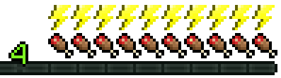
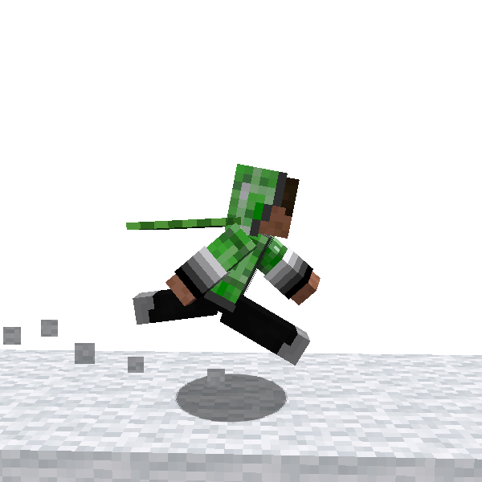
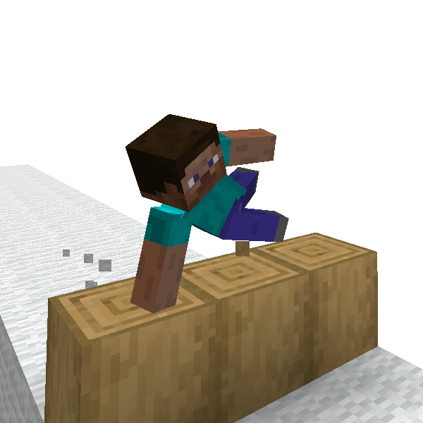
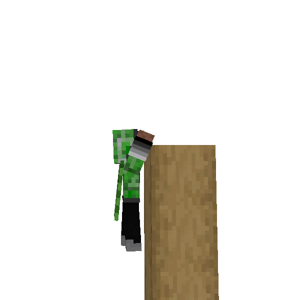
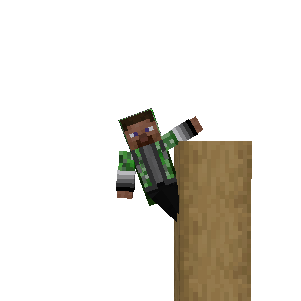
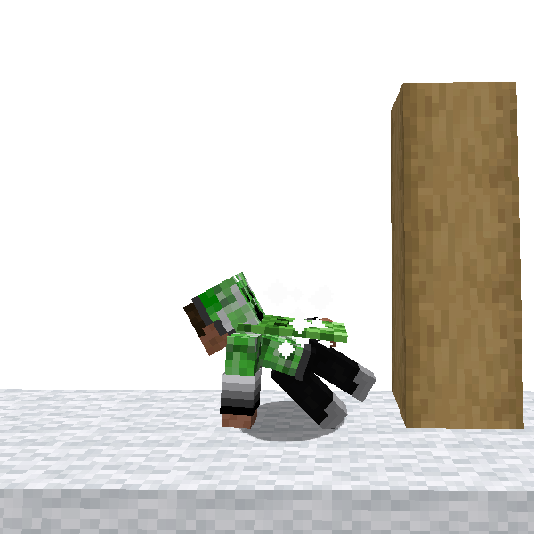

# Overview

Thank you for reading this guide!

ParCool provides many features to run around Minecraft Level speedy!

In this guide, I'll introduce basic features of this mod simply for beginners!
I hope you enjoy ParCool mod!

## Index

- [Stamina](#stamina)
- [Fast Run](#fast-run---the-basic-movement)
    - Basis of ParCool
- [Vault](#vault---getting-over-it)
    - Get over obstacles quickly
- [Cling To Cliff](#cling-to-cliff---get-over-more-high-obstacles)
    - Get over wall
- [Breakfall](#breakfall---absorb-falling-impact)
    - Reduce falling damage
- [Zipline](#zipline---parkour-facilities)
    - Connect 2 points and move faster
- [Afterword](#afterword)

---

## Stamina

First I have to introduce **Stamina** system.

Player has a new parameter called Stamina.
This expresses player's short-term fatigue.

Stamina is displayed above saturation of hotbar.

Almost ParCool actions consume stamina, and it recovers in relatively short time while resting.

You get these penalty when stamina is depleted.

- Disable to do almost all ParCool movement
- Disable to sprint, and cannot move quickly

---

## Fast Run - *The Basic Movement*

Fast Run is basic movement of ParCool. You can run faster than normal sprint.
ParCool provides dedicated animation!

In addition Fast Run is base of other movements. Please make use of it.

Its control is easy too, with default setting, just press Fast-Run key while you running. Fast-Run key is mapped to Ctrl
key.

---

## Vault - *Getting over it*

There are some actions derived from Fast Run.
One of them is **Vault**.

Vault is one of actual parkour skill, jumping over obstacles quickly.

It's automatically triggered by colliding to blocks while fast running

Also Vault makes it possible to get over fences.

### Technique - In-air Vault

You can vault in air. By utilize in-air vault it is possible to get over 2 blocks height obstacle quickly.
It may look difficult but actually quite easy.

---

## Cling To Cliff - *Get over more high obstacles*

I think there are times when you might want to climb up more high wall or obstacles.
So it's time to use **Cling To Cliff** movement!

It's easy to use. Just press *cling to cliff* key (Right Click) and touch edge of blocks.

Now you can Cling To Cliff! You can also look around while cling. Use of items is disabled.

Additionally, You can jump up onto the block by pressing jump key. Thanks to it, it's possible even to overcome 3 block
height obstacles!

ParCool enable even getting over 5 block height obstacles with combination of some movements. Please read pages of each
actions for details.

---

## Breakfall - Absorb falling impact

Here's one more important feature. **Breakfall**.

It's also known as actual parkour skill. This is a collective term of techniques which absorb/reduce impact of landing.
You can take less landing damage by using these skills in game!

ParCool provides 2 type Breakfall, but here I'll introduce one of them : **Roll**.

### Roll

**Roll** is one of breakfall techniques. It protects you by changing landing impact into rolling energy.

This is also easy to trigger. Just keep pressing *breakfall* key (R key) when you land. Roll is triggered if you are
pressing forward movement key at the time.

Tips! If you press breakfall key just before landing, *just-time breakfall* will be triggered. You gain larger damage
reduction and special effects!

---

## Zipline - Parkour facilities

Let me introduce you one more thing. It's **Zipline**.

For use of it we have to craft some items.

### Zipline Hook

First let's craft **Zipline Hook**!
There are 2 type variants. Which do you like?

After crafting, place the hooks positions where you want to

### Zipline Rope

Next let's craft **Zipline Rope**.

It is possible to change color by dying. Please craft it with dye items like leather armor.

Press shift + right click to select rope tension. After that use it to 2 zipline hooks.

Then let's ride on it by pressing *ride zipline* key (Right click)!

## Afterword

In this page I introduced some of important features of ParCool.

These are only a part of this mod. If you get interested in ParCool features, let's back and start to
read [ParCool Guide](Introduction.md) to learn all features and techniques for faster run!